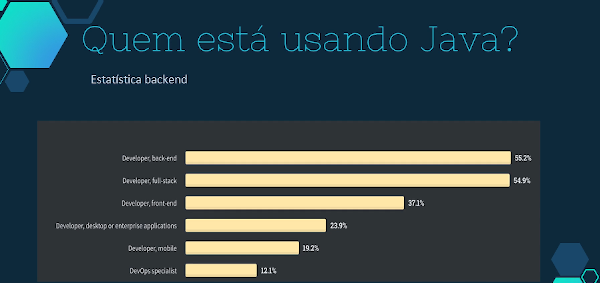
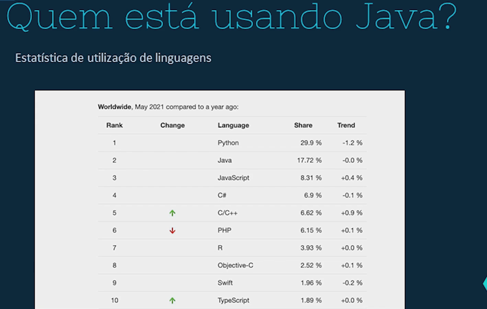
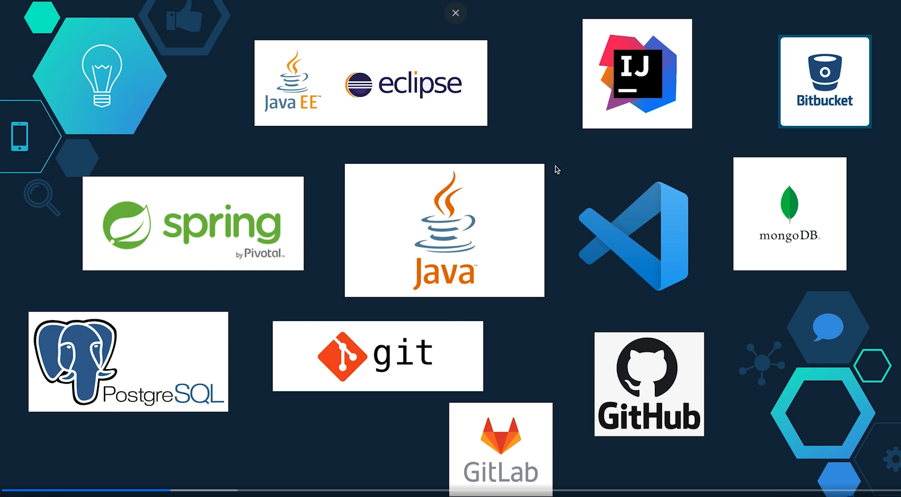

# Desmistificando o Backend e Frontend no Desenvolvimento de Software

## 🌐 Visão Geral

O desenvolvimento de software moderno é frequentemente dividido em duas grandes áreas: Backend e Frontend. Esta documentação visa esclarecer estas áreas, com foco especial no Backend, baseado nos dados e tecnologias apresentados em aula.

## 🔄 Frontend vs Backend

### Frontend

- Interface com a qual o usuário interage diretamente
- Responsável pela experiência do usuário (UX) e interface do usuário (UI)
- Tecnologias principais: HTML, CSS, JavaScript, TypeScript

### Backend

- "Cérebro" da aplicação
- Processa dados, gerencia regras de negócio e integrações
- Responsável pela segurança e performance da aplicação

## 📊 Estatísticas de Uso do Backend

Conforme apresentado nos gráficos da aula, o perfil dos desenvolvedores que utilizam Java (uma das principais linguagens backend) se distribui da seguinte forma:

- Backend Developer: 55.2%
- Full-stack Developer: 54.9%
- Frontend Developer: 37.1%
- Desktop/Enterprise Developer: 23.9%
- Mobile Developer: 19.2%
- DevOps Specialist: 12.1%

## 🌍 Popularidade das Linguagens de Programação (Maio 2021)

1. Python: 29.9% (-1.2%)
2. Java: 17.72% (0.0%)
3. JavaScript: 8.31% (+0.4%)
4. C#: 6.9% (-0.1%)
5. C/C++: 6.62% (+0.9%)
6. PHP: 6.15% (+0.1%)
7. R: 3.93% (0.0%)
8. Objective-C: 2.52% (+0.1%)
9. Swift: 1.96% (-0.2%)
10. TypeScript: 1.89% (0.0%)

## 🛠️ Algumas das principais Tecnologias Backend

### Java e seu Ecossistema

- **Java EE (Enterprise Edition)**: Framework para desenvolvimento de aplicações empresariais
- **Spring Framework**: Framework mais popular para desenvolvimento Java
- **Eclipse**: IDE popular para desenvolvimento Java
- **Maven/Gradle**: Gerenciadores de dependências

### Bancos de Dados

- **PostgreSQL**: Sistema de banco de dados relacional robusto
- **MongoDB**: Banco de dados NoSQL popular para aplicações modernas

### Controle de Versão e Colaboração

- **Git**: Sistema de controle de versão
- **GitHub/GitLab**: Plataformas de hospedagem de código e colaboração
- **Bitbucket**: Alternativa popular, especialmente em ambientes empresariais

### IDEs e Ferramentas

- **IntelliJ IDEA**: IDE popular para Java
- **VS Code**: Editor versátil que suporta desenvolvimento backend

## 💡 Porque o Backend é Importante

1. **Segurança**: Proteção de dados sensíveis e lógica de negócio
2. **Escalabilidade**: Capacidade de crescer conforme a demanda
3. **Integração**: Conexão com diferentes sistemas e serviços
4. **Performance**: Otimização de processos e consultas
5. **Consistência**: Garantia de integridade dos dados

## 🎯 Habilidades Necessárias para Backend

1. **Linguagens de Programação**: Java, Python, C#, etc.
2. **Banco de Dados**: SQL e NoSQL
3. **APIs**: REST, GraphQL
4. **Segurança**: Autenticação, Autorização, Criptografia
5. **DevOps**: CI/CD, Containers, Cloud

## 📚 Conclusão

O desenvolvimento backend é fundamental para construção de aplicações robustas e seguras. As estatísticas mostram uma forte presença de Java no mercado, especialmente em aplicações empresariais, mas também indicam uma diversidade de tecnologias e abordagens disponíveis para diferentes necessidades de projeto.

A escolha da stack tecnológica deve considerar fatores como:

- Requisitos do projeto
- Escalabilidade necessária
- Expertise da equipe
- Custos de desenvolvimento e manutenção
- Suporte e comunidade
