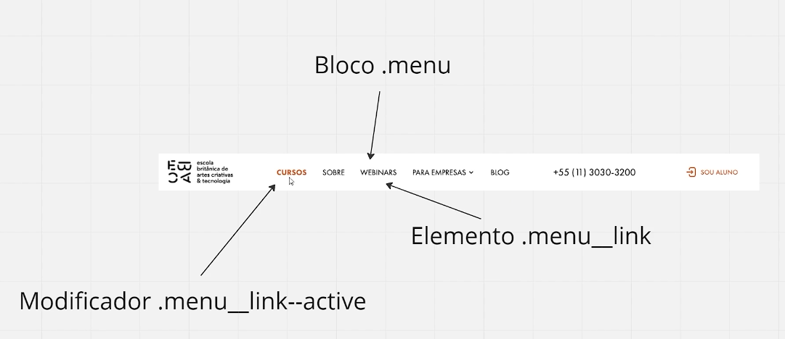

# 📝 Aula 3: Aplique a metodologia BEM

Nesta aula, vamos explorar a metodologia BEM (Block Element Modifier) e aprender a aplicá-la na prática para criar um código CSS mais organizado e fácil de manter. A metodologia BEM sugere uma nomenclatura específica para classes CSS, ajudando a separar claramente a estrutura (blocos), os componentes (elementos) e suas variações (modificadores).

### Estrutura da Metodologia BEM

1. **Block (Bloco)**: Representa um componente independente e reutilizável. Exemplo: `.form`.
2. **Element (Elemento)**: Representa um componente filho do bloco. Exemplo: `.form__control`.
3. **Modifier (Modificador)**: Representa uma variação ou estado de um bloco ou elemento. Exemplo: `.form__submit--sending`.

  

### Exemplo de Projeto

#### Arquivo HTML

```html
<!DOCTYPE html>
<html lang="pt-br">
  <head>
    <meta charset="UTF-8" />
    <meta name="viewport" content="width=device-width, initial-scale=1.0" />
    <title>Document</title>
    <link rel="stylesheet" href="bem/style.css" />
  </head>

  <body>
    <form class="form">
      <div class="form__control">
        <label for="nome">Seu nome:</label>
        <input type="text" id="nome" />
      </div>
      <button class="form__submit form__submit--sending" type="submit">Enviar</button>
    </form>
  </body>
</html>
```

#### Arquivo CSS

```css
.form {
  /*block*/
  margin: 40px;
}

.form__control {
  /*element*/
  margin-bottom: 16px;
  font-family: sans-serif;
}

.form__submit {
  /*element*/
  cursor: pointer;
}

.form__submit--sending {
  /*modifier*/
  cursor: wait;
}
```

### Boas Práticas de Nomenclatura BEM

- **Clareza**: Os nomes das classes devem ser descritivos o suficiente para indicar a função do bloco, elemento ou modificador.
- **Consistência**: Use a mesma estrutura de nomenclatura em todo o projeto para manter a consistência.
- **Modularidade**: Blocos devem ser independentes e reutilizáveis em diferentes partes do projeto.

### Vantagens da Metodologia BEM

- **Organização**: Facilita a leitura e manutenção do código CSS.
- **Reutilização**: Promove a criação de componentes reutilizáveis.
- **Previsibilidade**: Ajuda a evitar conflitos de estilos e facilita a identificação dos componentes e suas variações.

### Conclusão

A metodologia BEM é uma abordagem eficaz para estruturar e organizar o código CSS, tornando-o mais modular e fácil de manter. A nomenclatura clara e consistente facilita a colaboração entre desenvolvedores e a reutilização de componentes.

Para mais informações, consulte a documentação oficial do BEM em [getbem.com](https://getbem.com).
