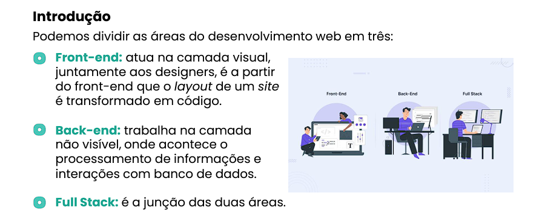
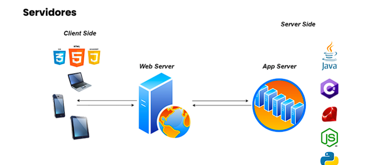

# 📝 Aula 1: Explore as áreas do desenvolvimento

## Topicos abordados na aula

- Identificar as diferenças entre Front-End e Back-End;

- Descrever o papel dos servidores no contexto do desenvolvimento web, tanto no Front-End quanto no Back-End;

- Compreender como o código escrito no Front-End é executado no navegador do cliente e como o código do Back-End é executado no servidor.

## Conteudo

| **Front-end**                                                                                                                         | **Back-end**                                                                                                            | **Full-stack**                         |
| ------------------------------------------------------------------------------------------------------------------------------------- | ----------------------------------------------------------------------------------------------------------------------- | -------------------------------------- |
| Front-end: atua na camada visual, juntamente aos designers, é a partir do front-end que o layout de um site é transformado em código. | Back-end: trabalha na camada não visível, onde acontece o processamento de informações e interações com banco de dados. | Full-stack: é a junção das duas áreas. |

- [x] O **front-end** tem trabalho multidisciplinar, além de estar em constante contato com a área de design, deve também se comunicar com o **back-end**, sendo responsável por fazer a integração entre as telas e aplicação desenvolvida no back-end.
- [x] A camada de front-end também é conhecida como **cliente-side** e o **back-end** de **server-side**, apesar desses nomes, os servidores também são importantes para o front-end, visto que nosso código HTML, CSS e JavaScript será armazenado neles.
- [x] A grande diferença está no local onde o código será executado, no **back-end** o código é executado no lado do servidor e o no **front-end** a execução é feita no lado do cliente, nesse contexto o cliente se refere aos navegadores e o dispositivo onde o navegador foi executado, celulares, tablets, notebooks, TVs etc.

[Baixar Material ](./Introdução%20ao%20desenvolvimento%20front-end.pdf)
