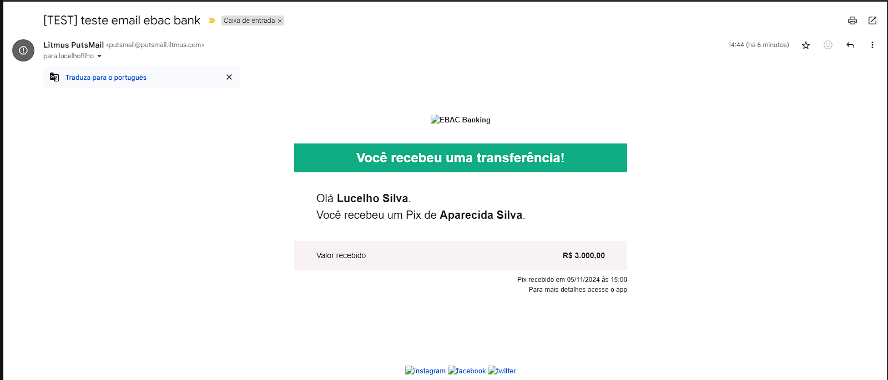
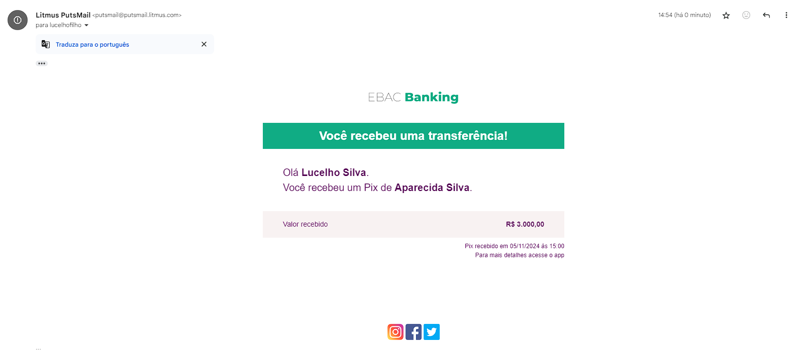

## 📝 Aula 02: Como testar um e-mail

Nesta aula, aprendemos sobre o processo de teste de e-mails e a importância desses testes para garantir que os e-mails sejam exibidos corretamente em diferentes dispositivos e clientes de e-mail.

## Processo de Teste

### Ferramenta Utilizada

Para efetuar os testes no e-mail criado, utilizamos a ferramenta **Litmus PutsMail**.

- Link: [Litmus PutsMail](https://putsmail.com/)

  

### Problema com Imagens Locais

Durante os testes, percebemos que as imagens não estavam aparecendo no e-mail enviado. Isso ocorreu porque as imagens estavam armazenadas localmente no computador e, para serem acessíveis no e-mail, precisam estar hospedadas em um servidor.

  

### Solução: Hospedagem das Imagens

Para resolver o problema, criamos um projeto no GitHub para hospedar as imagens. Em seguida, hospedamos o projeto na **Vercel**. Assim, as imagens se tornaram acessíveis via URLs, que foram inseridas no código HTML do e-mail.

Exemplo de URL de imagem hospedada:

- `https://servidor-estaticos.vercel.app/instagram.png`

### Resultado do Teste

Após hospedar as imagens na Vercel e atualizar as URLs no e-mail, realizamos o teste novamente e as imagens apareceram corretamente.

  

## Importância dos Testes

- **Compatibilidade:** Garantir que o e-mail seja exibido corretamente em diferentes dispositivos e clientes de e-mail.
- **Acessibilidade:** Verificar se todas as imagens e links estão funcionando corretamente.
- **Correção de Erros:** Identificar e corrigir problemas que possam surgir na renderização do e-mail.

Os testes são essenciais para garantir que o destinatário receba um e-mail funcional e visualmente agradável, independentemente da plataforma que ele utilize.
