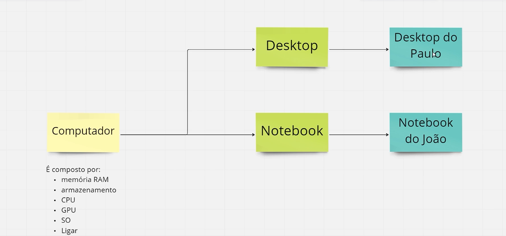
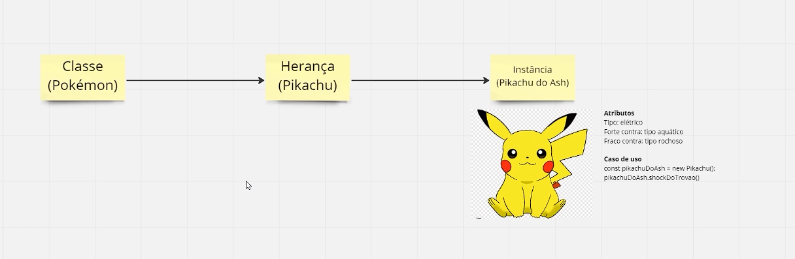
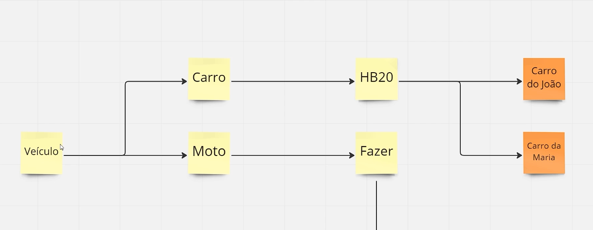

## Aula 1: Conheça a Orientação a Objetos

### Objetivos

-   Compreender os conceitos fundamentais da programação orientada a objetos.
-   Identificar e explicar os três pilares da POO: polimorfismo, herança e encapsulamento.
-   Conceituar a ideia de abstração e sua importância na programação.

### Conteúdo

Nesta aula, exploramos o conceito de **classe**, **herança** e **instância** através de exemplos práticos:



-   **Computador**
    -   **Classe**: Computador
    -   **Herança**: Notebook, Desktop
    -   **Instância**: Notebook do João, Desktop do Paulo



-   **Pokémon**
    -   **Classe**: Pokémon
    -   **Herança**: Pikachu
    -   **Instância**: Pikachu do Ash
    -   **Atributos**: Tipo elétrico, Forte contra: tipo aquático, Fraco contra: tipo rochoso



-   **Carro**
    -   **Classe**: Veículo
    -   **Herança**: Carro, Moto
    -   **Instância**: Carro do João, Carro da Maria

Esses exemplos ajudaram a ilustrar como os conceitos da POO podem ser aplicados para modelar situações do mundo real no código.

### Notação Ponto

A aula também abordou a **notação ponto**, que é utilizada para acessar os atributos e métodos de um objeto em POO. Exemplo de uso:

```javascript
const pikachuDoAsh = new Pikachu() // Instanciando o objeto
pikachuDoAsh.shockDoTrovao() // Chamando o método
```
