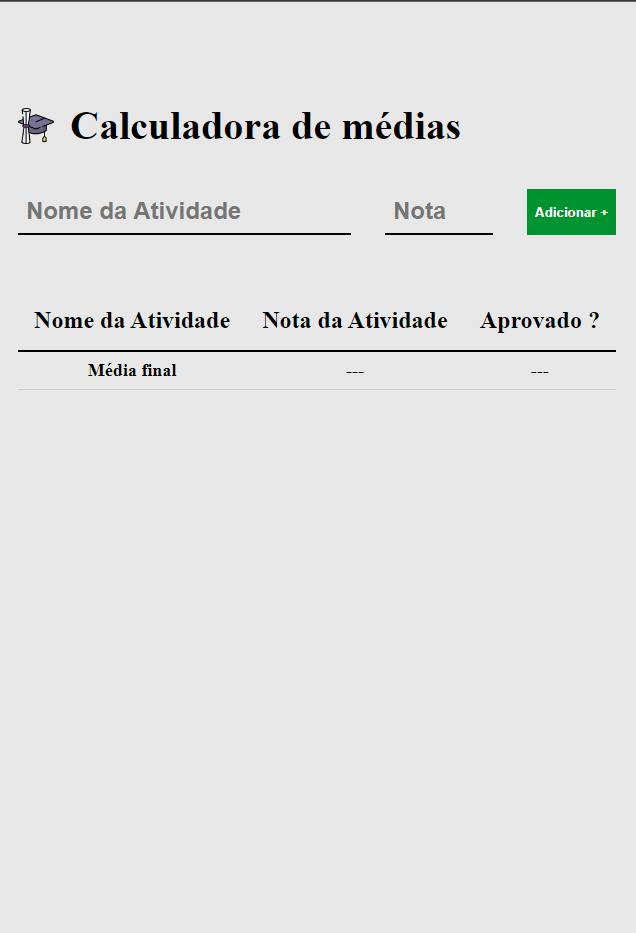

<h1 align="center"> Average Calculator </h1>

<p align="center">
  <a href="#descrição-do-projeto">Descrição do Projeto</a>&nbsp;&nbsp;&nbsp;|&nbsp;&nbsp;&nbsp;
  <a href="#tecnologias-utilizadas">Tecnologias Utilizadas</a>&nbsp;&nbsp;&nbsp;|&nbsp;&nbsp;&nbsp;
  <a href="#como-utilizar">Como Utilizar</a>&nbsp;&nbsp;&nbsp;|&nbsp;&nbsp;&nbsp;
  <a href="#licença">Licença</a>&nbsp;&nbsp;&nbsp;|&nbsp;&nbsp;&nbsp;
  <a href="#autor">Autor</a>
</p>

<p align="center">
  
</p>
<p align="center">
  
  
  
</p>

<br>

<p align="center">
  
</p>

## Descrição do Projeto

A "Calculadora de Médias" é uma aplicação web desenvolvida em HTML, CSS e JavaScript, projetada para auxiliar no cálculo de médias de notas atribuídas a atividades e tarefas. Esta ferramenta versátil é muito util para estudantes, professores e profissionais que desejam monitorar seu desempenho em várias tarefas e avaliações. Com uma interface simples, você pode inserir o nome da atividade e a nota correspondente, e a aplicação calculará automaticamente a média. Essa funcionalidade economiza tempo e ajuda a manter um registro organizado do progresso acadêmico ou profissional.

## Tecnologias Utilizadas

- **Linguagens:** HTML e CSS
- **Controle de Versão:** Git
- **Design e Prototipagem:** Figma
- **IDE:** Visual Studio Code
- **Hospedagem do Código:** GitHub

## Como Utilizar

Para utilizar o projeto localmente, siga estas etapas:

1. Faça o Fork do Repositório:

   ```bash
   clique no botão "Fork" no canto superior direito da página
   ```

2. Clone o repositório:

   ```bash
   git clone https://github.com/LucelhoSilva/Projects-HTML-CSS-JS.git
   cd Average-Calculator
   ```

## Licença

Este projeto está sob a [](./LICENSE). Consulte o arquivo [LICENSE](./LICENSE) para obter mais detalhes.

## Autor

Feito com ❤️ por Lucelho Silva. [Entre em contato !](https://www.linkedin.com/in/lucelho-silva-b17196239/)

Projeto feito com ajuda da EBAC (escola britânica de artes criativas e tecnologia)
